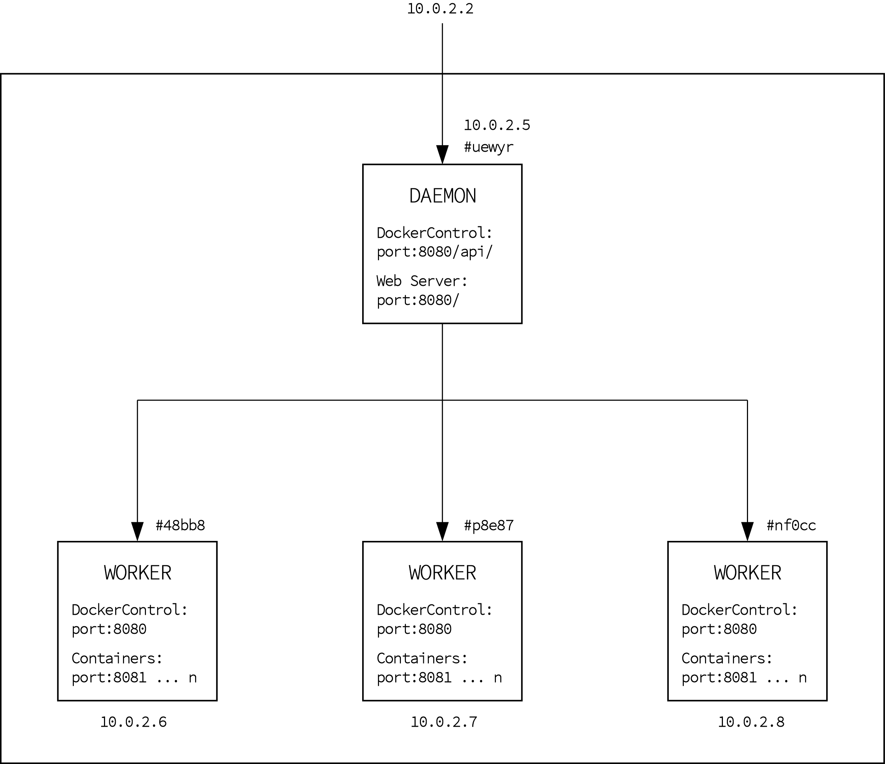
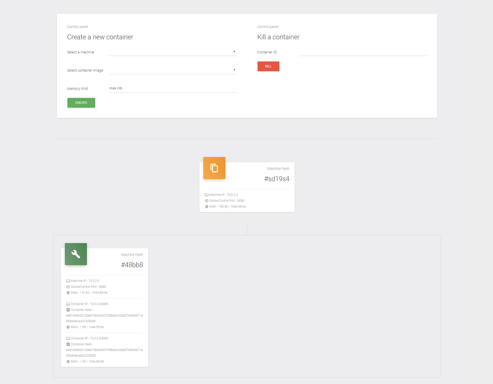

= Ročníková práce

Monorepo pro práci *Serverové služby*, která (ne)vznikala na link:https://github.com/sps-cl[@sps-cl] ve třetím ročníku (2017/18) jako má ročníková práce.
For legal reasons, není součástí repozitáře celá práce, nýbrž jen praktická část a stručné shrnutí.
Pro její pochopení a případné navázání to jistě stačí.

== 📃 Licence

Ve smyslu zákona č. 121/2000 Sb., o právu autorském, o právech souvisejících s právem
autorským, ve znění pozdějších předpisů (dále jen autorský zákon) jsou práva k maturitním
nebo ročníkovým pracím následující:

* Zadavatel má výhradní práva k využití práce, a to včetně komerčních účelů.
* Autor práce bez svolení zadavatele nesmí využít práci ke komerčním účelům.
* Škola má právo využít práci k nekomerčním a výukovým účelům i bez svolení zadavatele a
autora práce.

== 📋 Anotace

Tato práce se zabývá praktickým využitím paravirtualizace s využitím služby Docker
v serverovém prostředí.
V rámci ročníkové práce v oboru Informačních technologií jsem navrhl
vlastní systém se jménem DockerControl, sloužící pro dynamické řízení virtuálních instancí
napříč dostupnými fyzickými počítači, a to s pomocí vlastního API rozhraní nebo navržené
webové aplikace ve frameworku verze Angular 5.

== 📚 Dokumentace

Práce je primárně postavena na ovládání Docker API.
Ukazuje možnosti správy instancí (vytváření/ukončování), monitoring (prostředky, health check) a poskytuje rozhraní pro koncového uživatele.

Dělí se na tři samostatné balíčky, propojené vlastním Rest API:

* link:./dockercontrol-app/[dockercontrol-app]: Uživatelské rozhraní pro monitoring a ovládání.
* link:./dockercontrol-daemonserver[dockercontrol-daemonserver]: Proxy server sloužící jako hypervizor pro instance jednotlivých workerů a zároveň jako webový server pro poskytování _dockercontrol-app_.
* link:./dockercontrol-workerserver[dockercontrol-workerserver]: Worker server určený pro vykonávání samotné práce.

.Ukázka architektury

=== Uživatelské rozhrání

.Ukázka uživatelského rozhraní

=== Jak začít

Je potřeba npm, nodejs a Docker.
Spusťte jednotlivé projekty -- může běžet i v rámci jednoho stroje.
Worker instance musí poskytovat požadované API (viz implementovaný worker server).
Daemon instance je vyžadována právě jedna.

Konfigurace:

* link:./dockercontrol-app/[dockercontrol-app]: V souboru `src/environments/environment.ts` nastavte API URL na instanci daemon serveru.
* link:./dockercontrol-daemonserver[dockercontrol-daemonserver]: V poli `machines` je potřeba registrovat všechny požadované worker instance včetně portů, na kterých naslouchá jejich API.
* link:./dockercontrol-workerserver[dockercontrol-workerserver]: V objektu `config` nastavte port na kterém bude naslouchat TCP server pro ovládání worker instace.

== 🏆 Závěr

Práce dává minimalistický a přímočarý základ pro pochopení dynamické správy virtuálních instancí a dává prostor pro pokračování.
Jako ideální pokračování se jeví například implementace load balancing principů, které by studenta vedly k základnímu pochopení této oblasti.
Svým řešením nabízí transparentní a jednoduchý pohled na komplikovanou problematiku, pracuje s moderními nástroji a je velmi snadno provozovatelná.

Úspěšné pokračovatele této práce rád pozvu na pivo.footnote:[K zveřejnění této práce mě navedl Silák, kterého tímto srdečně zdravím a těším se, až usedneme k příštímu pivu.]

